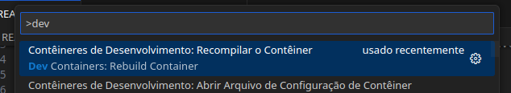

# Verilog Deployment

This project has the initiative to provide an environment for rapid development of HDL.

## Features

- Linters
- Formatters
- Documentation
- Netlist viewer
- Waveform viewer

## Getting Started

You just need to have installed on your machine:

- Docker
- Vscode with `ms-vscode-remote.remote-containers` extension

Open the vscode and Build Container Development

## Contributing

Contributions are welcome! Feel free to open issues or submit pull requests for bug fixes, enhancements, or new features.
